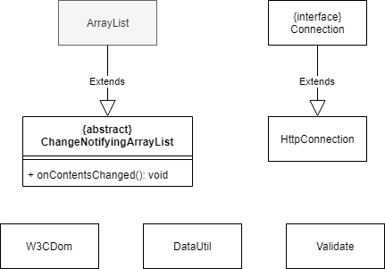
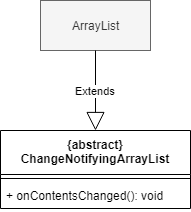
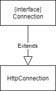

# Helper

**역할** 

# Class Diagram 
#

#

# 주요 클래스 설명
#
**ChangeNotifyingArrayList**: 
값이 변경될 때 마다 이를 알 수 있는 ArrayList 이다.
#
**DataUtil**: Document를 만들어주는 static 메소드 들의 집합이다.
#
**HttpConnection**: HTTP로 동작하도록 Connection 인터페이스를 구현한 클래스이다.
#
**Validate**: 유효성을 확인하고 에러를 발생시킨다.
#
**W3CDom**: jsoup.Document를 W3C Document로 변환해주는 클래스이다.
#
# 사용된 디자인패턴

템플릿 패턴과 전략 패턴이 사용되었다.

### **Template Pattern**

> #### source code
> helper/ChangeNotifyingArrayList.java



ChangeNotifyingArrayList Class는 ArrayList를 상속받는 추상 클래스이다.

여기에는 하나의 추상 메소드가 존재한다.
```
public abstract void onContentsChanged();
```
이 추상 메소드는 ArrayList 내부의 값이 변경이 될 때 마다 호출된다.

```
private static final class NodeList extends ChangeNotifyingArrayList<Node> {
    ...
    public void onContentsChanged() {
        owner.nodelistChanged();
    }
}
```
이 추상 메소드는 실제 구현은 하위 클래스로 위임된다.

### **Strategy Pattern**

> #### source code
> helper/HttpConnection.java 



Connection 인터페이스를 만들고 이를 구현한 HttpConnection을 생성하였다.
이는 HTTP 이외의 프로토콜에서도 Connection Interface를 구현하면 적용할 수 도록 전략 패턴이 적용 되었다.
