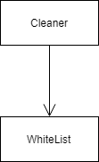

# Safety

**역할** HTML을 분석하기 이전에 필요한 속성만을 갖도록 만들어 준다.

# Class Diagram 
#

#
# 주요 클래스 설명
#
**Whitelist**: HTML에 허용하는 속성을 정의한 클래스
#
**Cleaner**: HTML파일에 whitelist를 적용해서 필요한 정보만으로 축약한다.
#
# 사용된 디자인패턴
#

# 기능 개선
#
#
# 목적
#
cleaner 클래스는 whitelist 객체를 사용하고 있다. 
whitelist는 허용되는 목록인데, 허용하지 않는 목록의 로직이 추가 될 수 있다.
따라서 cleaner 클래스가 좀 더 다양한 전략을 세울 수 있도록 만든다.
#
#
# 해결책
#
전략 패턴 적용
#
// TODO
# 기존 코드와의 비교 및 개선
#
// TODO
#