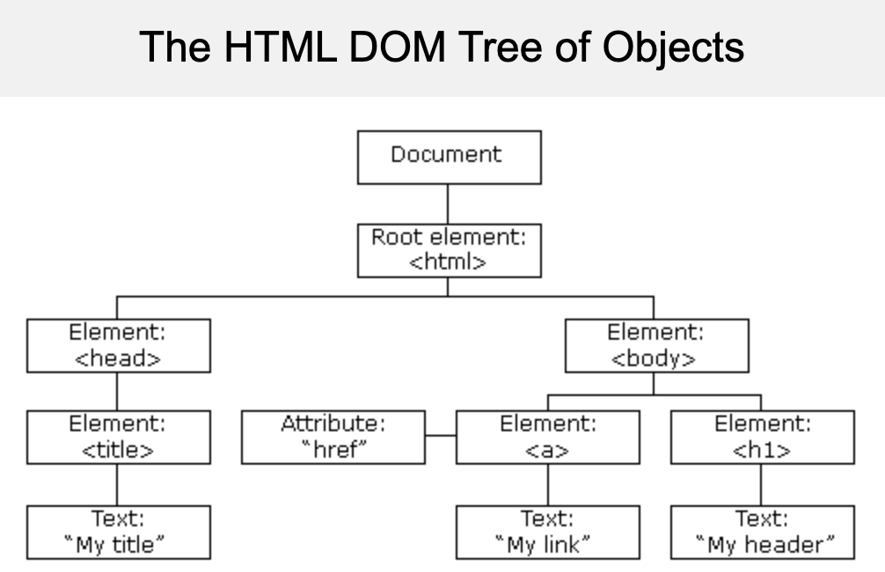
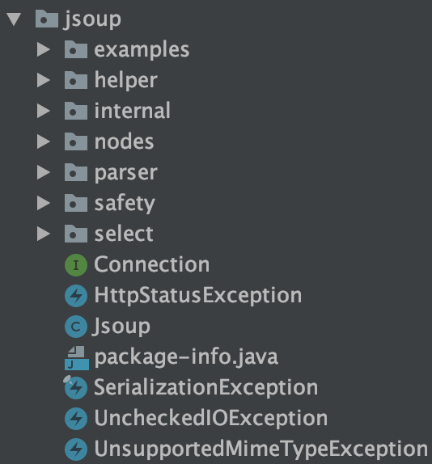
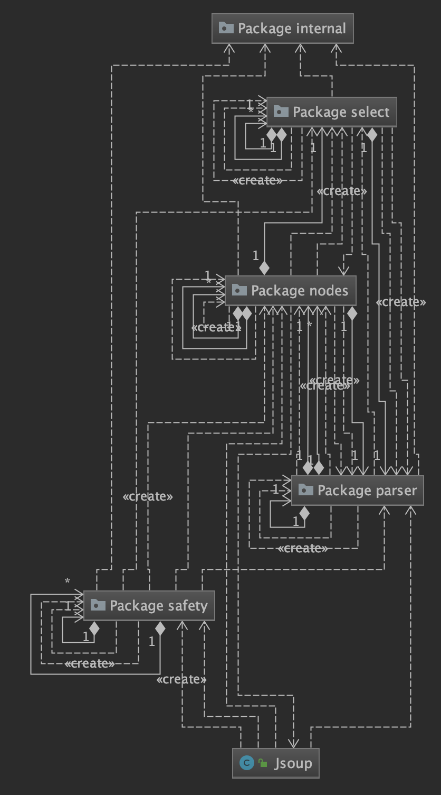
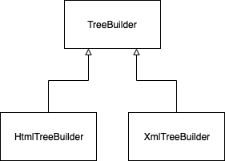
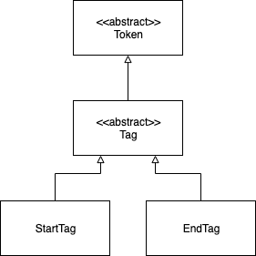
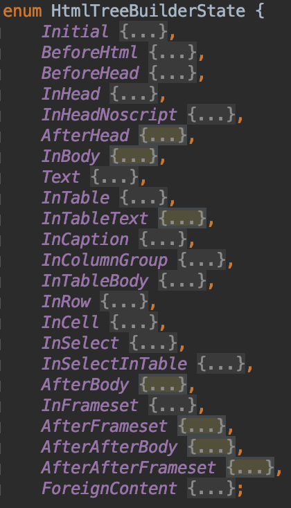

# 20133659 김성재 설계패턴 

## Overview

Jsoup은 HTML, XML및 CSS를 파싱해주는 Java library입니다. HTML, XML은 DOM(The Document Object Model) interface를 가지며 트리구조를 이루는 각각의 leaf를 node라고 칭합니다. Jsoup은 이러한 node 구조의 자료구조를 파싱하는 역할을 합니다.

<p align="center">
    	</img>
</p>


### 코드 및 패키지 구조

Jsoup의 패키지 구조는 다음과 같습니다. root directory에 `Jsoup` 이 존재하고 `Jsoup` 이 하위 패키지 `helper`, `internal`, `nodes`, `parser`, `safety`, `select` 등을 가지고 있습니다.

<p align="center">
    	</img>
</p>


Jsoup의 최상단 클래스인 `Jsoup` 이 하는 역할은 크게 다음과 같습니다.

- HTML을 받아서 parsing
- HTML을 파일 형태로 받아서 parsing
- Page URI를 받아서 parsing
- parsing할 HTML 중 원하는 것들만 뽑아서 보기 

```java
public class Jsoup {
    private Jsoup() {}
    public static Document parse(String html, String baseUri) {
        return Parser.parse(html, baseUri);
    }
    public static Document parse(String html, String baseUri, Parser parser) {
        return parser.parseInput(html, baseUri);
    }
    public static Document parse(String html) {
        return Parser.parse(html, "");
    }
    public static Connection connect(String url) {
        return HttpConnection.connect(url);
    }
    public static Document parse(File in, String charsetName, String baseUri) throws IOException {
        return DataUtil.load(in, charsetName, baseUri);
    }
    public static Document parse(File in, String charsetName) throws IOException {
        return DataUtil.load(in, charsetName, in.getAbsolutePath());
    }
    public static Document parse(InputStream in, String charsetName, String baseUri) throws IOException {
        return DataUtil.load(in, charsetName, baseUri);
    }
    public static Document parse(InputStream in, String charsetName, String baseUri, Parser parser) throws IOException {
        return DataUtil.load(in, charsetName, baseUri, parser);
    }
    public static Document parseBodyFragment(String bodyHtml, String baseUri) {
        return Parser.parseBodyFragment(bodyHtml, baseUri);
    }
    public static Document parseBodyFragment(String bodyHtml) {
        return Parser.parseBodyFragment(bodyHtml, "");
    }
    public static Document parse(URL url, int timeoutMillis) throws IOException {
        Connection con = HttpConnection.connect(url);
        con.timeout(timeoutMillis);
        return con.get();
    }
    public static String clean(String bodyHtml, String baseUri, Whitelist filter) {
        Document dirty = parseBodyFragment(bodyHtml, baseUri);
        Cleaner cleaner = new Cleaner(filter);
        Document clean = cleaner.clean(dirty);
        return clean.body().html();
    }
    public static String clean(String bodyHtml, Whitelist filter) {
        return clean(bodyHtml, "", filter);
    }
    public static String clean(String bodyHtml, String baseUri, Whitelist filter, Document.OutputSettings outputSettings) {
        Document dirty = parseBodyFragment(bodyHtml, baseUri);
        Cleaner cleaner = new Cleaner(filter);
        Document clean = cleaner.clean(dirty);
        clean.outputSettings(outputSettings);
        return clean.body().html();
    }
    public static boolean isValid(String bodyHtml, Whitelist filter) {
        return new Cleaner(filter).isValidBodyHtml(bodyHtml);
    }
}

```


<p align="center">
    	</img>
</p> 

`jsoup`은 다음과 같이 `safety`, `nodes`, `parser` 에게 의존하고 있는 것을 볼 수 있습니다. 즉 다른 패키지들은 `safety`, `nodes`, `parser`와 같은 패키지들의 하위 모듈로 사용되고 있음을 알 수 있습니다.


## Parser

Parser는 `Html` 또는 `Xml`을 String형태로 받아서 알맞은 Tree 형태로 반환하는 역할을 하고 있는 컴포넌트입니다.


Parser는 크게 다음과 같은 2가지의 패턴으로 이루어져 있습니다. 

- Template Method Pattern
- State Pattern

파서 전체가 패턴으로 구조화된 것은 아니고 부분적으로 패턴이 녹아 있습니다. 

#### Template Method Pattern

<p align="center">
    	</img>
</p> 

`TreeBuilder`라는 abstract class를 `HtmlTreeBuilder`와 `XmlTreeBuilder`가 extends하고 있습니다. Html과 Xml의 구조를 만들 때 공통적으로 쓰이는 부분을 추상화 시켜서 추상 클래스를 만들었습니다. 

> TreeBuilder 내부의 행위를 추상화하는 abstract 메소드나 interface 필드는 없습니다. 그렇기 때문에 Strategy Pattern은 쓰이지 않았습니다.


#### Strategy Pattern

`TreeBuilder`를 보면 다음과 같은 abstract method와 해당 process가 Start인지 End인지에 따라서 다른 행위를 취하는 Strategy Pattern 사용을 유추해 볼 수 있습니다.

```java
 protected abstract boolean process(Token token);

    protected boolean processStartTag(String name) {
        if (currentToken == start) { // don't recycle an in-use token
            return process(new Token.StartTag().name(name));
        }
        return process(start.reset().name(name));
    }

    public boolean processStartTag(String name, Attributes attrs) {
        if (currentToken == start) { // don't recycle an in-use token
            return process(new Token.StartTag().nameAttr(name, attrs));
        }
        start.reset();
        start.nameAttr(name, attrs);
        return process(start);
    }

    protected boolean processEndTag(String name) {
        if (currentToken == end) { // don't recycle an in-use token
            return process(new Token.EndTag().name(name));
        }
        return process(end.reset().name(name));
    }


    protected Element currentElement() {
        int size = stack.size();
        return size > 0 ? stack.get(size-1) : null;
    }

```

Strategy Pattern을 확인하기 위해 `Token` class를 보면 `Token` class는 abstract class임을 알 수 있습니다. 그리고 `Tag`라는 내부 abstract static 클래스를 선언하고 `Token`을 상속 있습니다. 여기서 Tag는 다시 한 번, 내부 static 클래스인 `StartTag`와 `EndTag`에 의해 상속됩니다.

```java
final static class StartTag extends Tag {
    ...
}

final static class EndTag extends Tag{
    ...
}
```

 그리고 `StartTag`와 `EndTag`는 위에서 언급한 process, processStartTag, processEndTag에서 사용되고 있습니다. 즉, Strategy Pattern으로 Token 상태에 따라 행위를 결정하고 있습니다.

  <p align="center">
    	</img>
</p> 


#### State Pattern

Parser에서는 `HtmlTreeBuilderState`와 `TokeniserState` 에서 State Pattern을 적용하고 있습니다.

Template Method Pattern에서 언급한 `TreeBuilder` 안에는 process(Token token)`라는  abstract method가 존재합니다.

```java
    protected abstract boolean process(Token token);
```

그리고 `HtmlTreeBuilder ` 안에는 abstract method의 구현체가 있고 `HtmlTreeBuilderState` 안의 또 다른 abstract method를 실행하고 있습니다.

```java
@Override
protected boolean process(Token token) {
    currentToken = token;
    return this.state.process(token, this);
}
```


<p align="center">
    	</img>
</p> 

`HtmlTreeBuilderState` 는 enum 클래스입니다. `HtmlTreeBuilderState` 안에는 아래의 로직들이 있고 `process`라는 abstract 메서드가 있습니다. 그리고 위 그림의 enum 필드는 `process` 를 구현하고 있습니다.

```java
    abstract boolean process(Token t, HtmlTreeBuilder tb);
```


아래는 enum 필드의 하나인 `Initial` 필드입니다. 해당 필드는 `process` 를 구현하고 있습니다.

```java
    Initial {
        boolean process(Token t, HtmlTreeBuilder tb) {
            if (isWhitespace(t)) {
                return true; // ignore whitespace
            } else if (t.isComment()) {
                tb.insert(t.asComment());
            } else if (t.isDoctype()) {
                // todo: parse error check on expected doctypes
                // todo: quirk state check on doctype ids
                Token.Doctype d = t.asDoctype();
                DocumentType doctype = new DocumentType(
                    tb.settings.normalizeTag(d.getName()), d.getPublicIdentifier(), d.getSystemIdentifier());
                doctype.setPubSysKey(d.getPubSysKey());
                tb.getDocument().appendChild(doctype);
                if (d.isForceQuirks())
                    tb.getDocument().quirksMode(Document.QuirksMode.quirks);
                tb.transition(BeforeHtml);
            } else {
                // todo: check not iframe srcdoc
                tb.transition(BeforeHtml);
                return tb.process(t); // re-process token
            }
            return true;
        }
    },
```


그리고 해당 state는 `HtmlTreeBuilder`에서 transition method로 context를 주입받고 있습니다.

```java
    void transition(HtmlTreeBuilderState state) {
        this.state = state;
    }
```

```java
void resetInsertionMode() {
        boolean last = false;
        for (int pos = stack.size() -1; pos >= 0; pos--) {
            Element node = stack.get(pos);
            if (pos == 0) {
                last = true;
                node = contextElement;
            }
            String name = node.normalName();
            if ("select".equals(name)) {
                transition(HtmlTreeBuilderState.InSelect);
                break; // frag
            } else if (("td".equals(name) || "th".equals(name) && !last)) {
                transition(HtmlTreeBuilderState.InCell);
                break;
            } else if ("tr".equals(name)) {
                transition(HtmlTreeBuilderState.InRow);
                break;
            } else if ("tbody".equals(name) || "thead".equals(name) || "tfoot".equals(name)) {
                transition(HtmlTreeBuilderState.InTableBody);
                break;
            } else if ("caption".equals(name)) {
                transition(HtmlTreeBuilderState.InCaption);
                break;
            } else if ("colgroup".equals(name)) {
                transition(HtmlTreeBuilderState.InColumnGroup);
                break; // frag
            } else if ("table".equals(name)) {
                transition(HtmlTreeBuilderState.InTable);
                break;
            } else if ("head".equals(name)) {
                transition(HtmlTreeBuilderState.InBody);
                break; // frag
            } else if ("body".equals(name)) {
                transition(HtmlTreeBuilderState.InBody);
                break;
            } else if ("frameset".equals(name)) {
                transition(HtmlTreeBuilderState.InFrameset);
                break; // frag
            } else if ("html".equals(name)) {
                transition(HtmlTreeBuilderState.BeforeHead);
                break; // frag
            } else if (last) {
                transition(HtmlTreeBuilderState.InBody);
                break; // frag
            }
        }
    }
```

 `HtmlTreeBuilderState` 는 Html의 tree를 만들 때, tree node의 state에 따라(e.g. Head, Body...) `HtmlTreeBuilder`의 상태(state)가 바뀌고 있습니다. 즉 `process` 의 행위가 바뀌도록 하는 `State Pattern`을 사용하고 있습니다.

