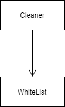

# Safety

**역할** HTML을 분석하기 이전에 필요한 속성만을 갖도록 만들어 준다.

# Class Diagram 
#

#

# 주요 클래스 설명
#
**Whitelist**: HTML에 허용하는 속성을 정의한 클래스
#
**Cleaner**: HTML파일에 whitelist를 적용해서 필요한 정보만으로 축약한다.
#
# 사용된 디자인패턴
#

# 기능 개선, 기존 코드와의 비교 및 개선


Safety 클래스의 Cleaner를 보면 Cleaner 클래스는 Whitelist를 필드로 가지고있다. Whitelist에서 설정한 Tag들을 Cleaner에서 가져와서, 설정된 Tag만을 파싱해서 가져오는 기능이다.

Whitelist를 이용하면 사용자가 원하는 Tag만 골라서 파싱할 수 있다. 하지만 만약 10개의 태그가 존재하고, 사용자는 9개의 Tag를 원한다면 "9개의 Tag를 원한다" 보다는 "1개의 Tag를 제외하겠다" 가 훨씬 편하다. 그렇기 때문에 Blacklist를 만들었다.


기존의 Whitelist와 반대되는 Blacklist를 만든다는게 기본적인 생각이지만 Whitelist 클래스는 그 존재 자체가 행위에 해당된다. 즉 추상화할 행위가 없다는 것이다. 그렇기 때문에 더 상위 개념인 Cleaner 중 공통 로직이 들어가는 copySafeNodes를 추상화시켰다.

```java
abstract int copySafeNodes(Element source, Element dest);
```

그리고 사용자가 원하는 상황에 따라 Blacklist, Whitelist를 적용시킨다.


```java
public static String cleanWhitelist(String bodyHtml, Filter filter) {
    return cleanWhitelist(bodyHtml, "", filter);
}
```


```java
public static String cleanBlacklist(String bodyHtml, Filter filter) {
    return cleanBlacklist(bodyHtml, "", filter);
}
```

 구조 개선을 하였고, 기능 구현은 TODO로 남아있다.

기존의 Whitelist 기능은 다음과 같이 정상적으로 모든 테스트를 통과한다.


# 목적

#
cleaner 클래스는 whitelist 객체를 사용하고 있다. 
whitelist는 허용되는 목록인데, 허용하지 않는 목록의 로직이 추가 될 수 있다.
따라서 cleaner 클래스가 좀 더 다양한 전략을 세울 수 있도록 만든다.
#
#
# 해결책
#
전략 패턴 적용
#
// TODO
#